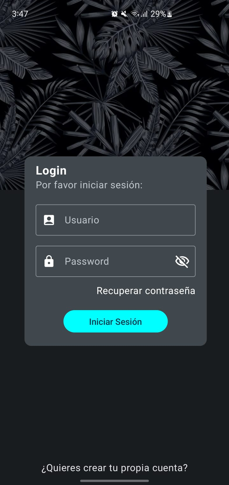
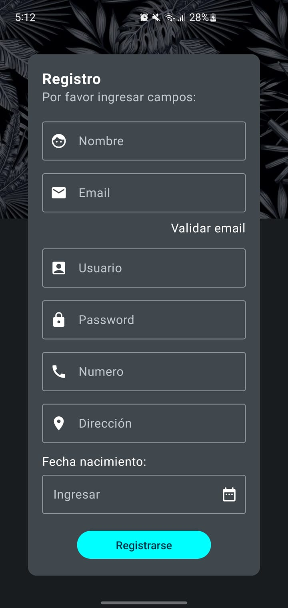
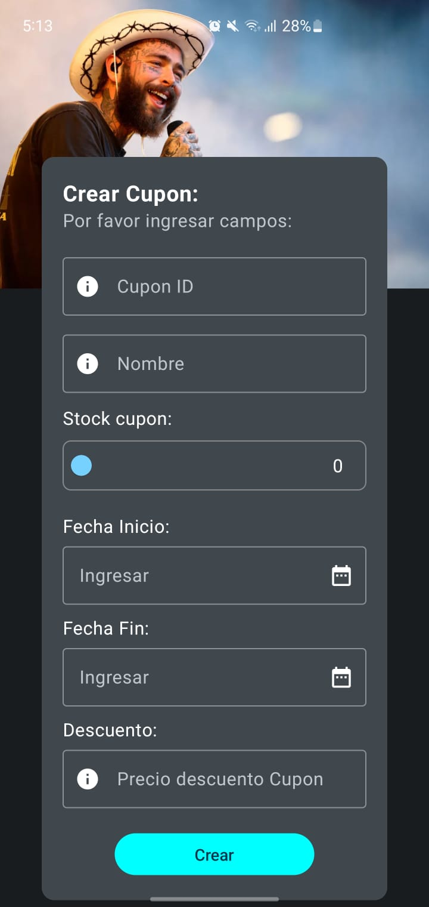
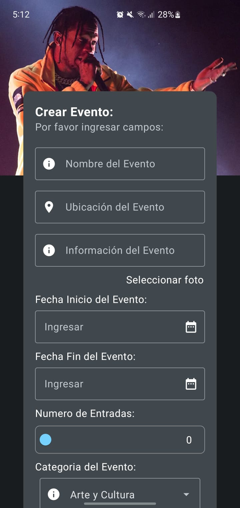
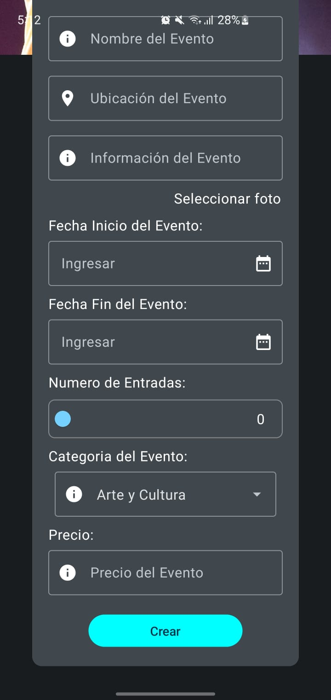
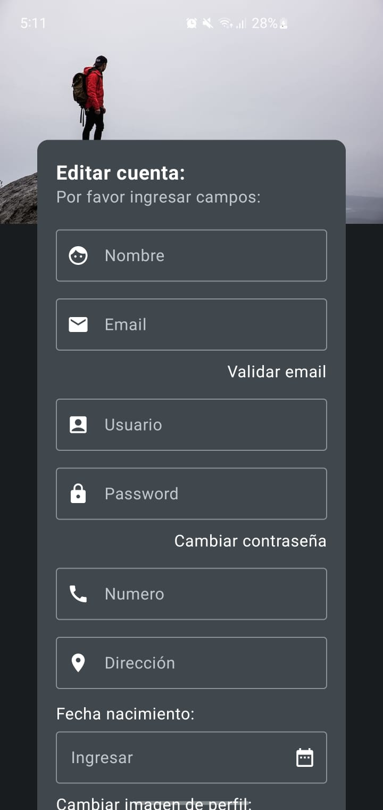
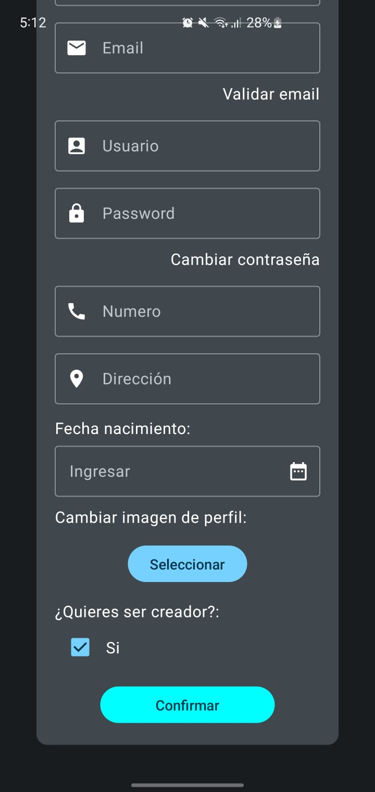
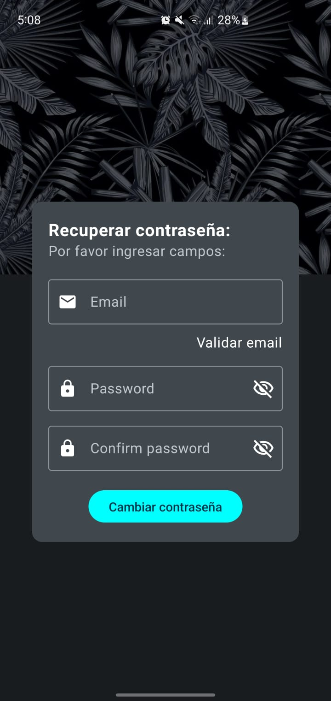

# Unieventos
Despues de la creación de Prototipos se hizo los componentes y las pantallas correspondientes:
### Login de Usuarios 

 
  

### Registro de Usuarios

 
  

### Creación de Cupones

 
  

### Creación de Eventos

 
  

 
  

### Editar Cuenta

 
  

 
  

### Recuperar Contraseña

 
  

